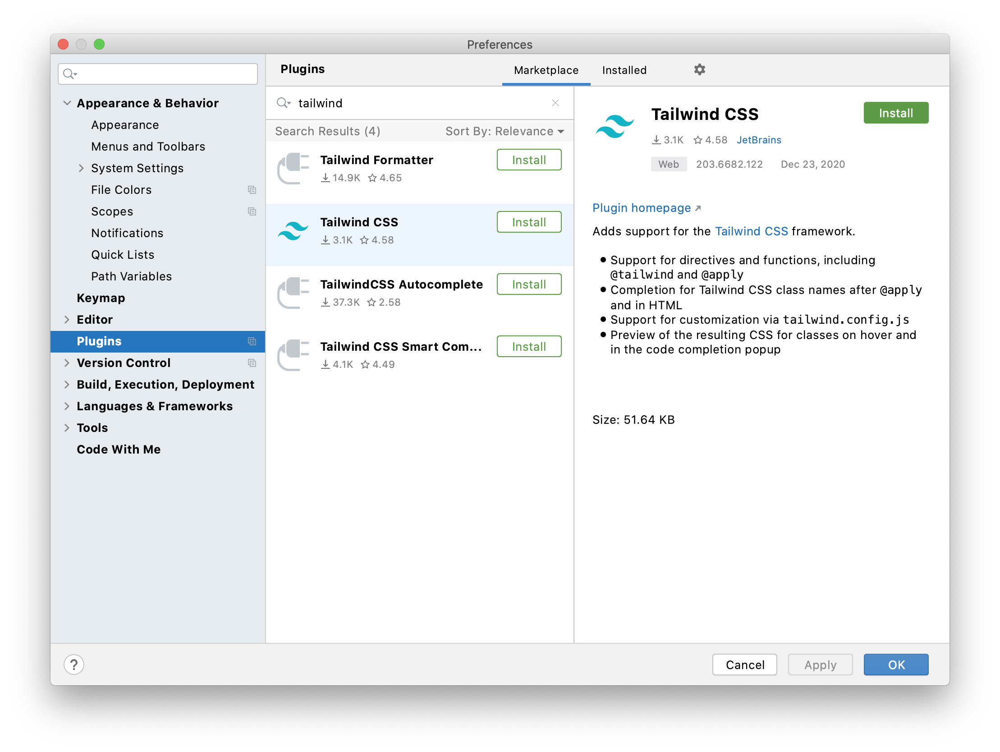

# Tailwind CSS Starter

Unfortunately [using Tailwind via CDN](https://tailwindcss.com/docs/installation#using-tailwind-via-cdn) 
or ready CSS file has a lot of restrictions
and takes of big part of functionality
such as customize Tailwind's default theme.

By this reason I prepare a starter with simples preset for a work with Tailwind
(based on [Installing Tailwind CSS as a PostCSS plugin](https://tailwindcss.com/docs/installation#installing-tailwind-css-as-a-post-css-plugin)).


## Prerequirements

Please [install Node.js](https://nodejs.org/en/download/)
(recommend using [nvm](https://github.com/nvm-sh/nvm#installing-and-updating) (Node Version Manager)).

### Install dependencies

For working with Tailwind you should have Tailwind and some toolchain for it. 
Please install all of them:

```shell
npm install
```

### Work in IntelliJ Platform based IDE's

For correct Tailwind directives highlight and code completion
please install Tailwind CSS plugin:




## Project structure

### Introduction

For all power of Tailwind (theme configuration for example)
you should build source code with Tailwind PostCSS plugin by Tailwind team. 
By these reason we should have `source code` and build `output`.
Also Tailwind requires Node.js, PostCSS and itself config.

### Structure

So in root of you project you can find:
- [`src`](./src) dir – directory with compiling source codes.
  In this directory you can find [`default.css`](./src/styles/default.css)
  which includes Tailwind CSS.  
  This `default.css` is hardcoded in build scripts.
  If you would like to work with it, please check scripts in [`package.json`](./package.json)

- [`output`](./output) dir – example of final assets for a static server.
  - By current build configuration it has generated [`styles/default.css`](./output/styles/default.css).
    This css file is result of build [`./src/default.css`](./src/styles/default.css).
    It's also hardcoded in build scripts.
    If you would like to work with it, please check scripts in [`package.json`](./package.json).  
  - Other files in this dir `index.html` and `images` are just examples.
    They should be replaced by your assets.    
    Keep in mind two important things about integration your final html and Tailwind CSS.
    1. HTML files should be linked with CSS from `output`, because CSS from `src` dir isn't compiled.
    2. For normal size of final a CSS file in production mode
       Tailwind tool should analyze all final HTML files,
       so **please run production build of Tailwind CSS after HTML files generation**
       (glob path for analyzing html you can find in [`tailwind.config.js`](./tailwind.config.js)).
       
- [`tailwind.config.js`](./tailwind.config.js) –
  [Tailwind CSS configuration](https://tailwindcss.com/docs/configuration) file.

- [`postcss.config.js`](./postcss.config.js) –
  [PostCSS](https://github.com/postcss/postcss) configuration file.  
  PostCSS – is the simples way of extending CSS syntax.
  By this way Tailwind CSS uses PostCSS and provide a plugin for it.
  But this magic requires Node.js and build time...

- [`package.json`](./package.json) – [standard](https://docs.npmjs.com/cli/v6/configuring-npm/package-json)
  Node.js project file for [`npm`](https://docs.npmjs.com/about-npm).
  It contains:
  - project dependencies deps list;
  - project scripts (build in our case);
  - some project info;
    
- [`package-lock.json`](./package-lock.json) – [standard](https://docs.npmjs.com/cli/v6/configuring-npm/package-lock-json)
  lock file for `npm`

### Moving in my project

> In simplest way you should copy with saving paths.
> If files structure of the sample doesn't fit for you,
> please fix paths in build scripts in `package.json` for CSS files
> and paths in `tailwind.config` for HTML files.  
> Reasons of this you can find in ['Structure' part](#structure)

You should copy with saving paths:
- [`src/styles/default.css`](./src/styles/default.css);
- [`output/styles/default.css`](./output/styles/default.css);
- [`tailwind.config.js`](./tailwind.config.js)

If you already have `postcss.config.js` in you project
just add Tailwind CSS and Autoprefixer plugins
```javascript
module.exports = {
  // this object with plugins should contain `tailwindcss` and `autoprefixer`
  // if you already have `autoprefixer` here, just add `tailwindcss` only.
  plugins: {
    tailwindcss: {},
    autoprefixer: {},
  }
};
```
else, please copy:
- [`postcss.config.js`](./postcss.config.js)

If you already have `package.json` and `package-lock.json` in you project
just install deps
```shell
npm install --save tailwindcss
npm install --save-dev postcss postcss-cli cross-env autoprefixer
```
and move scripts (you can rename it as you want, [info about npm scripts](https://docs.npmjs.com/cli/v6/configuring-npm/package-json#scripts))
```json
{
  "scripts": {
    "start": "postcss -w ./src/styles/default.css -o ./output/styles/default.css",
    "build": "postcss ./src/styles/default.css -o ./output/styles/default.css",
    "build:prod": "cross-env NODE_ENV=production postcss ./src/styles/default.css -o ./output/styles/default.css"
  }
}
```
else, please copy:
- [`package.json`](./package.json)
- [`package-lock.json`](package-lock.json)

That's all. Have a lovely time.


## Run watch mode
For auto building of css run it in hatch mode 

```shell
npm start
```

## Build

### Build in dev mode

If you just want to build CSS with Tailwind, use

```shell
npm run build
```

### Build in dev production mode

Before publish in production, please run
(please check before 
that all your final html files match with [`tailwind.config.js`](./tailwind.config.js)
`purge` paths ([detailed](https://tailwindcss.com/docs/optimizing-for-production))) 

```shell
npm run build:prod
```


